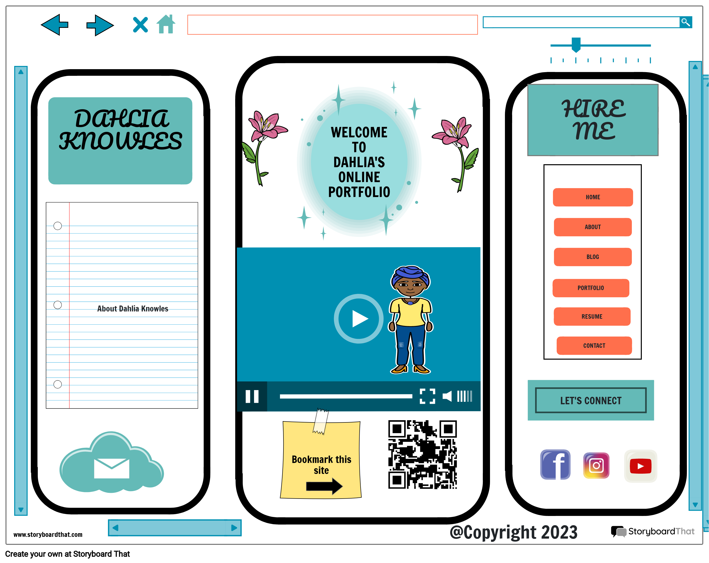
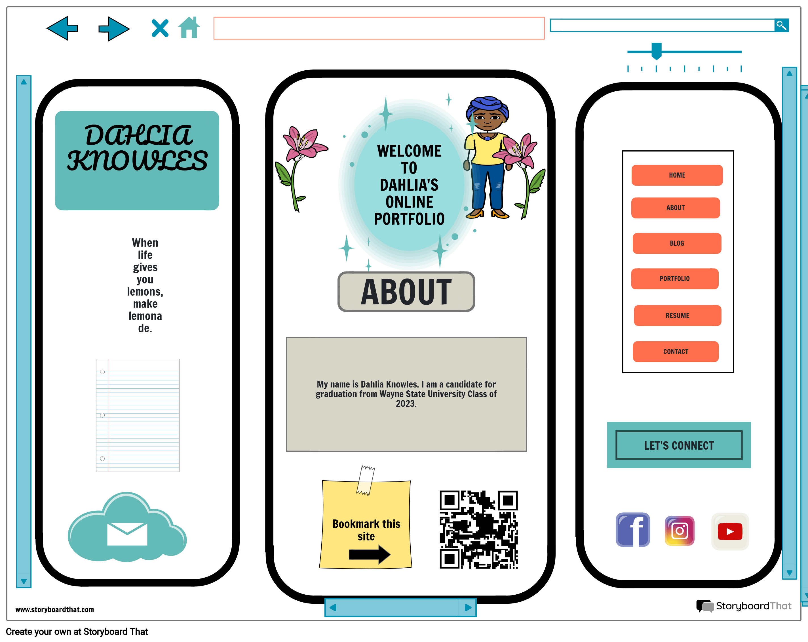
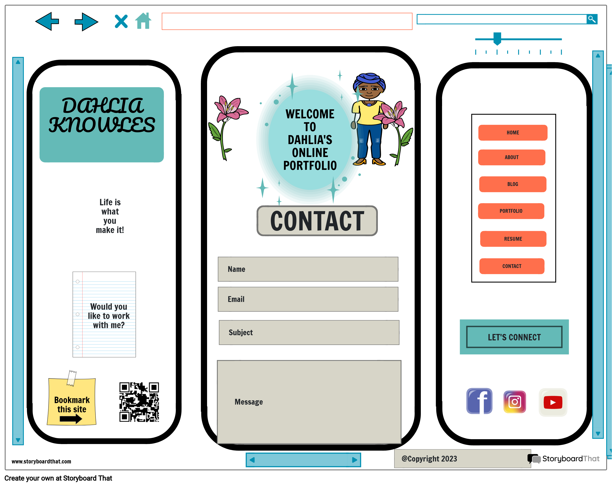

# Dahlia Knowles' INF6420 Project

A portfolio site showcasing Dahlia Knowles at Wayne State University 2021-2023.

## Wireframes

Planning out a website can be necessary but it sure involves strategic plans.

  

Header - the header includes my name in eye catching lettering

Navigation Menu - has links to other pages such as home, about, blog, etc.

The main content will share with you the reason for this  and it will market my skills.

Footer - includes copyright information and bottom bar

  

Header - the header includes my name in eye catching lettering  

Navigation Menu - has links to other pages such as home, about, blog, etc.

The main content will share with you information about me

Footer - includes copyright information and bottom bar

    

Header - the header includes my name in eye catching lettering 

Navigation Menu - has links to other pages such as home, about, blog, etc.

The main content will share with you how to contact me if you would like to collaborate with me.

Footer - includes copyright information and bottom bar